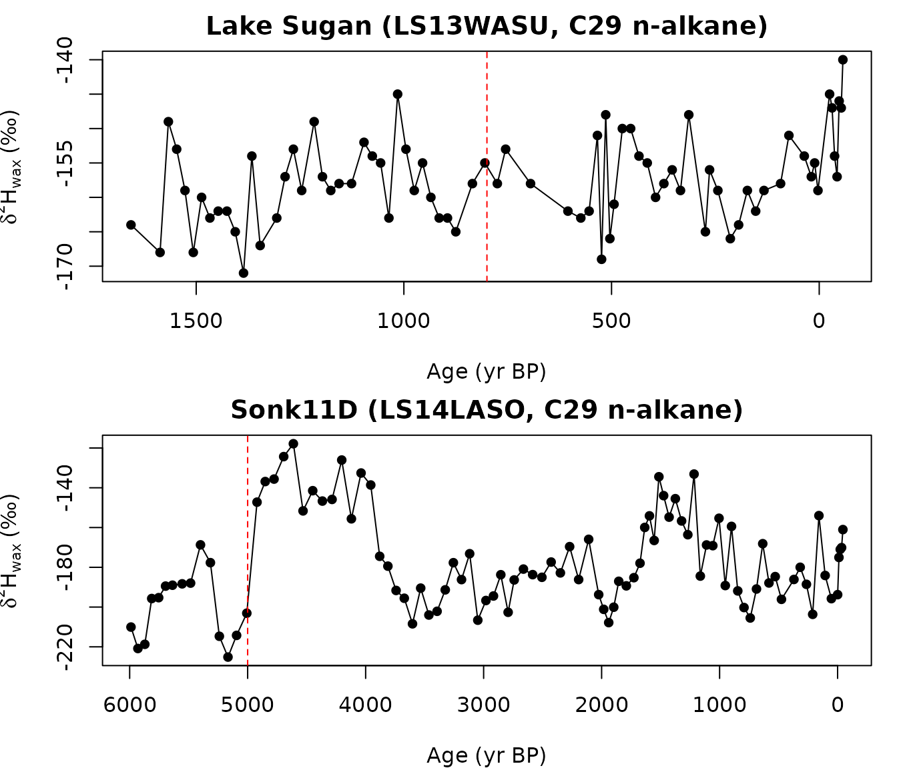
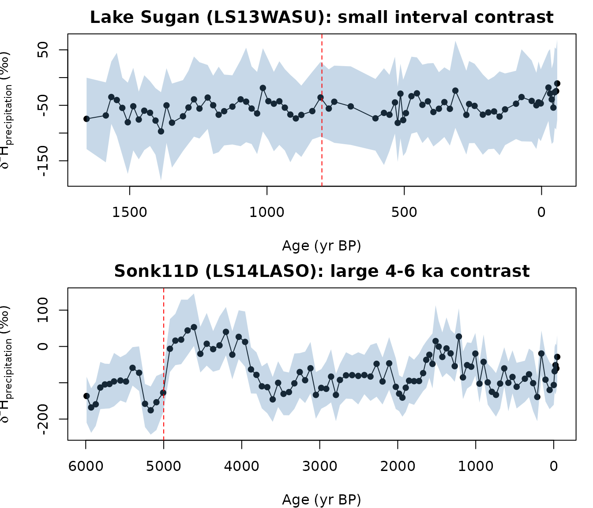

# When does a leaf-wax record support a precipitation-isotope claim?

The workflow reconstructs `d2H_precip` from a downcore leaf-wax series
and tests whether the reconstructed signal is large enough to support a
published claim of change. The central question for any record is
whether the difference in `d2H_precip` between two stratigraphic
intervals can be distinguished from calibration-plus-analytical noise,
and at what confidence level.

The vignette runs the chain on two Iso2k records with different signal
sizes and sampling structures. Both examples use C29 n-alkane `d2H_wax`,
matching the compound class used by the calibration. The package ships
small CSV extracts containing finite C29 rows from the source LiPD
files; the extraction script is in `data-raw/`.

| Package file | Iso2k record | Source study | Data archive |
|----|----|----|----|
| `LS13WASU_C29_d2H.csv` | [LS13WASU](https://lipdverse.org/iso2k/1_0_0/LS13WASU.html), [LiPD](https://lipdverse.org/iso2k/1_0_0/LS13WASU.lpd) | Wang et al. (2013), [doi:10.1177/0959683613486941](https://doi.org/10.1177/0959683613486941) | Iso2k LiPD source |
| `LS14LASO_C29_d2H.csv` | [LS14LASO](https://lipdverse.org/iso2k/1_0_0/LS14LASO.html), [LiPD](https://lipdverse.org/iso2k/1_0_0/LS14LASO.lpd) | Lauterbach et al. (2014), [doi:10.1177/0959683614534741](https://doi.org/10.1177/0959683614534741) | PANGAEA, [doi:10.1594/PANGAEA.834963](https://doi.org/10.1594/PANGAEA.834963) |

The Iso2k compilation is archived at
[doi:10.25921/57j8-vs18](https://doi.org/10.25921/57j8-vs18).

The per-sample detection threshold used by
[`detect_change()`](https://bradleylab.github.io/leafwax/reference/detect_change.md)
is

``` math
\mathrm{threshold}_{\mathrm{precip}}
= \frac{1.96 \sqrt{2(1 - \rho_t)}\, \sqrt{\sigma_{\mathrm{residual}}^2 + \sigma_{\mathrm{analytical}}^2}}{\beta_{\mathrm{eff}}}
```

where `rho_t` is the lag-1 temporal autocorrelation, `sigma_residual` is
the calibration residual SD on the wax scale, `sigma_analytical` is the
analytical uncertainty on the wax measurements, and `beta_eff` is the
local effective slope. This is the smallest `d2H_precip` change between
two independent samples at this site that can be distinguished from
within-record noise at 95 percent confidence. The spatial GP intercept
contributes equally to every sample in the record and cancels in any
contrast between intervals.

## 1. Load both records

``` r

library(leafwax)

example_record_path <- function(filename) {
  installed_path <- system.file(
    "extdata", "example_records", filename,
    package = "leafwax"
  )
  if (nzchar(installed_path)) {
    return(installed_path)
  }

  source_paths <- file.path(
    c("inst", file.path("..", "inst")),
    "extdata", "example_records", filename
  )
  source_path <- source_paths[file.exists(source_paths)][1]
  if (!is.na(source_path)) {
    return(source_path)
  }

  stop("Could not locate example record: ", filename, call. = FALSE)
}

sugan_path <- example_record_path("LS13WASU_C29_d2H.csv")
sugan <- read.csv(sugan_path)
sugan$d2h_wax <- sugan$d2H_wax
sugan$age     <- sugan$age_yrBP

sonk_path <- example_record_path("LS14LASO_C29_d2H.csv")
sonk <- read.csv(sonk_path)
sonk$d2h_wax <- sonk$d2H_wax
sonk$age     <- sonk$age_yrBP

c(sugan_n        = nrow(sugan),
  sugan_range_pm = round(diff(range(sugan$d2h_wax)), 1),
  sonk_n         = nrow(sonk),
  sonk_range_pm  = round(diff(range(sonk$d2h_wax)), 1))
#>        sugan_n sugan_range_pm         sonk_n  sonk_range_pm 
#>           78.0           31.0           98.0          107.3
```

Lake Sugan sits at 38.8667° N, 93.95° E (2,800 m) in the Qaidam Basin.
Sonk11D sits at 41.7939° N, 75.1961° E (3,016 m) in the Central Tian
Shan. In these extracts, Sugan spans -57 to 1657 yr BP, and Sonk11D
spans -45 to 5989 yr BP.

## 2. Plot the leaf-wax records

Before estimating a precipitation-isotope signal, inspect the measured
`d2H_wax` series and the interval boundaries used below.

``` r

op <- par(mfrow = c(2, 1), mar = c(4, 4, 2, 1))

plot_wax <- function(record, title, boundary) {
  ord <- order(record$age)
  plot(
    record$age[ord],
    record$d2h_wax[ord],
    type = "o", pch = 16, col = "black",
    xlim = rev(range(record$age)),
    xlab = "Age (yr BP)",
    ylab = expression(delta^2 * H[wax] ~ "(‰)"),
    main = title
  )
  abline(v = boundary, lty = 2, col = "red")
}

plot_wax(sugan, "Lake Sugan (LS13WASU, C29 n-alkane)", boundary = 800)
plot_wax(sonk, "Sonk11D (LS14LASO, C29 n-alkane)", boundary = 5000)
```



``` r


par(op)
```

The dashed red lines mark the same interval boundaries used in the
change-detection and claim-assessment examples.

## 3. Claim levels used by `assess_claim()`

[`assess_claim()`](https://bradleylab.github.io/leafwax/reference/assess_claim.md)
reports the highest claim level supported by the record and the supplied
evidence. A level only passes if every lower level has also passed.

| Level | Claim being made | What must be supplied or demonstrated |
|----|----|----|
| 1 | A leaf-wax `d2H` change occurred between two intervals. | The interval-mean wax contrast exceeds analytical uncertainty at the chosen confidence level, after the requested `rho_t` adjustment. |
| 2 | The wax change is consistent with a directional hydroclimate change. | Level 1 passes and `corroborating_proxies` contains named, non-empty evidence. |
| 3 | The wax change supports a quantitative `d2H_precip` magnitude. | Level 2 passes, a defended `beta_eff` is supplied, the full inversion posterior is available, and the posterior probability of exceeding `magnitude_precip` meets the requested confidence level. |
| 4 | The quantitative magnitude is uniquely attributable to precipitation isotopes. | Level 3 passes and independent evidence supports stationary vegetation, source-water seasonality, and evapotranspirative enrichment over the interval. |

The functions enforce the structure of the evidence fields. They do not
decide whether a proxy interpretation or stationarity argument is
scientifically adequate; that still requires record-specific evidence
and citations.

## 4. Local effective slope

[`local_effective_slope()`](https://bradleylab.github.io/leafwax/reference/local_effective_slope.md)
returns posterior draws for the site-specific `d2H_wax`-`d2H_precip`
slope, combining the global posterior `beta_oipc` with the spatial slope
GP. The function does not apply a ceiling or otherwise filter the draws.
Passing the full vector to
[`invert_d2H()`](https://bradleylab.github.io/leafwax/reference/invert_d2h.md)
propagates slope uncertainty through the reconstruction; passing a
scalar, such as the posterior median, gives a point-slope sensitivity
run.

``` r

sugan_lon <- 93.95;   sugan_lat <- 38.8667
sonk_lon  <- 75.1961; sonk_lat  <- 41.7939

slope_sugan <- suppressWarnings(local_effective_slope(
  longitude = sugan_lon, latitude = sugan_lat,
  model_name = "baseline_sp", n_draws = 100,
  verbose = FALSE
))

slope_sonk <- suppressWarnings(local_effective_slope(
  longitude = sonk_lon, latitude = sonk_lat,
  model_name = "baseline_sp", n_draws = 100,
  verbose = FALSE
))

rbind(
  sugan = quantile(slope_sugan, c(0.025, 0.5, 0.975)),
  sonk  = quantile(slope_sonk,  c(0.025, 0.5, 0.975))
)
#>            2.5%       50%     97.5%
#> sugan 0.2453382 0.3878862 0.5338104
#> sonk  0.3050322 0.4423601 0.5633999
```

## 5. Bayesian inversion with the local slope

[`invert_d2H()`](https://bradleylab.github.io/leafwax/reference/invert_d2h.md)
accepts the slope vector from the previous section. The `record_id`
argument enforces that all rows belong to one site; `return_full = TRUE`
keeps the posterior draws matrix needed by
[`detect_change()`](https://bradleylab.github.io/leafwax/reference/detect_change.md).
Wax-error sampling uses analytical uncertainty plus the model’s
posterior residual SD; the same residual applies to within-record
contrasts because the spatial GP intercept cancels in any difference
between intervals.

``` r

recon_sugan <- suppressWarnings(invert_d2H(
  d2H_wax    = sugan$d2h_wax,
  d2H_wax_sd = rep(3, nrow(sugan)),
  longitude  = rep(sugan_lon, nrow(sugan)),
  latitude   = rep(sugan_lat, nrow(sugan)),
  model_name = "baseline_sp",
  n_posterior_draws = 100,
  slope        = slope_sugan,
  record_id    = "LS13WASU",
  return_full  = TRUE,
  verbose      = FALSE
))

recon_sonk <- suppressWarnings(invert_d2H(
  d2H_wax    = sonk$d2h_wax,
  d2H_wax_sd = rep(3, nrow(sonk)),
  longitude  = rep(sonk_lon, nrow(sonk)),
  latitude   = rep(sonk_lat, nrow(sonk)),
  model_name = "baseline_sp",
  n_posterior_draws = 100,
  slope        = slope_sonk,
  record_id    = "LS14LASO",
  return_full  = TRUE,
  verbose      = FALSE
))
```

## 6. Detection threshold and posterior probability of change

[`detect_change()`](https://bradleylab.github.io/leafwax/reference/detect_change.md)
returns the per-sample detection threshold and the posterior probability
that the difference in mean `d2H_precip` between two intervals exceeds a
target magnitude. The example below passes `sigma_residual = 16`, the
residual scale used for the package’s spatial-model examples; for a full
analysis, use the residual SD from the fitted calibration being
propagated.

[`estimate_temporal_autocorrelation()`](https://bradleylab.github.io/leafwax/reference/estimate_temporal_autocorrelation.md)
returns the lag-1 correlation of age-ordered residuals after a flat-mean
detrend. This is a deliberately simple AR(1) estimator: transparent for
near-regular records and an approximation for irregular records. For
irregular paleo series, treat `rho_t` as a sensitivity parameter or
replace it with a method designed for uneven sampling. Change-point
tools such as `bcp` and `Rbeast` answer a different question: they can
help test whether a boundary or trend is independently supported, but
they are not substitutes for the lag-1 `rho_t` used in the
detection-threshold formula. A Lomb-Scargle estimator is planned for
v0.3 (`method = "lomb_scargle"`).

The Sugan example contrasts the last eight centuries with the older part
of the record, a low-amplitude test case. The Sonk11D example contrasts
adjacent 4-5 ka and 5-6 ka intervals, where the extracted C29 n-alkane
series has a much larger wax-isotope contrast.

``` r

rho_sugan <- estimate_temporal_autocorrelation(
  sugan$d2h_wax, sugan$age, method = "ar1"
)

dc_sugan <- detect_change(
  reconstruction    = recon_sugan,
  age               = sugan$age,
  baseline_interval = c(-100, 800),
  test_intervals    = list(older = c(800, 1700)),
  sigma_residual    = 16,
  sigma_analytical  = 3,
  rho_t             = rho_sugan,
  beta_eff          = stats::median(slope_sugan),
  confidence        = 0.95,
  magnitudes        = c(10, 30, 50)
)
#> Warning: leafwax preview posteriors in use (detect_change): 100 draws of
#> 'baseline_sp'. Tail probabilities and 95% credible intervals are unstable at
#> this sample size; not suitable for inference. Run
#> download_model_data("baseline_sp") for the full posterior.

rho_sonk <- estimate_temporal_autocorrelation(
  sonk$d2h_wax, sonk$age, method = "ar1"
)

dc_sonk <- detect_change(
  reconstruction    = recon_sonk,
  age               = sonk$age,
  baseline_interval = c(4000, 5000),
  test_intervals    = list(early_holocene = c(5000, 6000)),
  sigma_residual    = 16,
  sigma_analytical  = 3,
  rho_t             = rho_sonk,
  beta_eff          = stats::median(slope_sonk),
  confidence        = 0.95,
  magnitudes        = c(10, 30, 50)
)
#> Warning: leafwax preview posteriors in use (detect_change): 100 draws of
#> 'baseline_sp'. Tail probabilities and 95% credible intervals are unstable at
#> this sample size; not suitable for inference. Run
#> download_model_data("baseline_sp") for the full posterior.

list(
  sugan = list(rho_t = round(rho_sugan, 3),
               threshold_permil = round(dc_sugan$threshold, 1),
               intervals        = dc_sugan$intervals),
  sonk = list(rho_t = round(rho_sonk, 3),
              threshold_permil = round(dc_sonk$threshold, 1),
              intervals        = dc_sonk$intervals)
)
#> $sugan
#> $sugan$rho_t
#> [1] 0.203
#> 
#> $sugan$threshold_permil
#> [1] 103.8
#> 
#> $sugan$intervals
#>   interval n_baseline n_test delta_mean delta_median delta_lower delta_upper
#> 1    older         41     37  -9.301603    -7.864667   -31.47903    8.930941
#>   p_abs_delta_gt_10 p_abs_delta_gt_30 p_abs_delta_gt_50
#> 1              0.48              0.04              0.01
#> 
#> 
#> $sonk
#> $sonk$rho_t
#> [1] 0.716
#> 
#> $sonk$threshold_permil
#> [1] 54.4
#> 
#> $sonk$intervals
#>         interval n_baseline n_test delta_mean delta_median delta_lower
#> 1 early_holocene         12     15  -137.2436    -137.8394   -200.0781
#>   delta_upper p_abs_delta_gt_10 p_abs_delta_gt_30 p_abs_delta_gt_50
#> 1    -94.7102                 1                 1                 1
```

The two records produce different verdicts. Sugan: lag-1 autocorrelation
0.2, 95 percent detection threshold approximately 104 per mil, posterior
probability of a 30 per mil shift 0.04. Sonk11D: lag-1 autocorrelation
0.72, threshold approximately 54 per mil, posterior probability of a 30
per mil shift 1.00. The Sugan interval contrast is small relative to
calibration noise. The Sonk11D interval contrast is large enough that
the example quantitative claim passes the posterior-probability test.

## 7. Assess a published claim

The example below asks whether each record can support an asserted Level
4 claim of a 30 per mil `d2H_precip` change. The strings supplied as
corroborating and stationarity evidence demonstrate the required API
structure; they are not a substitute for a record-specific literature
review.

``` r

build_claim <- function(beta_eff, rho_t, baseline, test, magnitude_precip) {
  list(
    level             = 4,
    interval_baseline = baseline,
    interval_test     = test,
    sigma_analytical  = 3,
    rho_t             = rho_t,
    confidence        = 0.95,
    beta_eff          = beta_eff,
    magnitude_precip  = magnitude_precip,
    corroborating_proxies = list(
      regional_proxy = "regional records show coeval shift"
    ),
    vegetation_stationary = list(
      value    = TRUE,
      evidence = "n-alkane chain length distributions stable across the boundary"
    ),
    seasonal_source_stationary = list(
      value    = TRUE,
      evidence = "regional d18O record shows no seasonality shift"
    ),
    evapotranspirative_stationary = list(
      value    = TRUE,
      evidence = "leaf-water proxy stable; no aridity transition"
    )
  )
}

sugan_record <- data.frame(
  d2h_wax     = sugan$d2h_wax,
  age         = sugan$age,
  d2h_wax_err = rep(3, nrow(sugan))
)
sonk_record <- data.frame(
  d2h_wax     = sonk$d2h_wax,
  age         = sonk$age,
  d2h_wax_err = rep(3, nrow(sonk))
)

verdict_sugan <- suppressWarnings(assess_claim(
  record         = sugan_record,
  claim          = build_claim(stats::median(slope_sugan),
                                rho_sugan,
                                c(-100, 800), c(800, 1700),
                                magnitude_precip = 30),
  reconstruction = recon_sugan
))

verdict_sonk <- suppressWarnings(assess_claim(
  record         = sonk_record,
  claim          = build_claim(stats::median(slope_sonk),
                                rho_sonk,
                                c(4000, 5000), c(5000, 6000),
                                magnitude_precip = 30),
  reconstruction = recon_sonk
))

c(sugan_highest_level  = verdict_sugan$highest_level,
  sugan_supported_at_4 = verdict_sugan$asserted_supported,
  sonk_highest_level   = verdict_sonk$highest_level,
  sonk_supported_at_4  = verdict_sonk$asserted_supported)
#>  sugan_highest_level sugan_supported_at_4   sonk_highest_level 
#>                    0                    0                    4 
#>  sonk_supported_at_4 
#>                    1
```

Read each `verdict$levels` data frame top to bottom: every level above
the highest one passed is reported with the reason it failed. The Sugan
claim fails at the within-record noise step. The Sonk11D claim clears
Level 4 in this API demonstration because the interval contrast is large
and the example supplies stationarity evidence. Those stationarity
strings are placeholders; a real Level 4 claim requires record-specific
evidence and citations.

## 8. Plot the reconstructions

``` r

op <- par(mfrow = c(2, 1), mar = c(4, 4, 2, 1))

plot_recon <- function(rec, ages, title, boundary) {
  ord <- order(ages)
  plot(
    ages[ord],
    rec$summary$d2h_precip_median[ord],
    type = "o", pch = 16, col = "black",
    xlim = rev(range(ages)),
    ylim = range(c(rec$summary$d2h_precip_lower,
                   rec$summary$d2h_precip_upper)),
    xlab = "Age (yr BP)",
    ylab = expression(delta^2 * H[precipitation] ~ "(‰)"),
    main = title
  )
  polygon(
    c(ages[ord], rev(ages[ord])),
    c(rec$summary$d2h_precip_lower[ord],
      rev(rec$summary$d2h_precip_upper[ord])),
    border = NA, col = adjustcolor("steelblue", alpha.f = 0.3)
  )
  abline(v = boundary, lty = 2, col = "red")
}

plot_recon(recon_sugan, sugan$age,
           "Lake Sugan (LS13WASU): small interval contrast",
           boundary = 800)
plot_recon(recon_sonk, sonk$age,
           "Sonk11D (LS14LASO): large 4-6 ka contrast",
           boundary = 5000)
```



``` r


par(op)
```

Each shaded band is the 90 percent credible interval per sample,
propagating analytical uncertainty, regression-parameter uncertainty,
the local slope posterior, and the calibration’s posterior residual SD.
The dashed red line marks the interval boundary used in the
change-detection and claim-assessment examples.

## Takeaway

A record’s ability to support a `d2H_precip`-change claim depends on
three quantities evaluated for that record: its within-record `d2H_wax`
interval-mean contrast relative to `sigma_residual`, the local effective
slope, and the lag-1 temporal autocorrelation.
[`detect_change()`](https://bradleylab.github.io/leafwax/reference/detect_change.md)
packages these into a single threshold and a posterior probability;
[`assess_claim()`](https://bradleylab.github.io/leafwax/reference/assess_claim.md)
walks them through the four-level taxonomy. Low-amplitude contrasts can
fail at the initial within-record wax-change screen. Larger contrasts
can clear directional hydroclimate-change claims and provide stronger
quantitative evidence, but a Level 4 claim still requires posterior
support at the chosen confidence level.

## Notes

- The vignette uses 100 posterior draws for speed. Production
  reconstructions should use the full posterior (omit `n_draws` and
  `n_posterior_draws`).
- The built-in
  [`estimate_temporal_autocorrelation()`](https://bradleylab.github.io/leafwax/reference/estimate_temporal_autocorrelation.md)
  is a flat-mean lag-1 estimator and assumes near-regular spacing. For
  irregular paleo series, use sensitivity analyses or a dedicated
  uneven-sampling autocorrelation method for `rho_t`. Use `bcp` or
  `Rbeast` for complementary change-point or trend checks, not as direct
  `rho_t` estimators.
